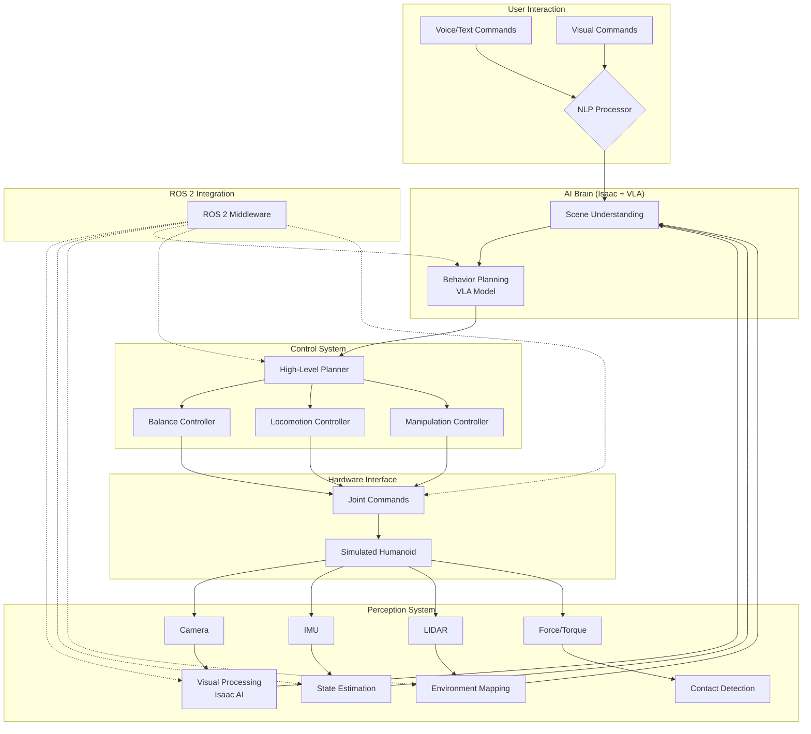
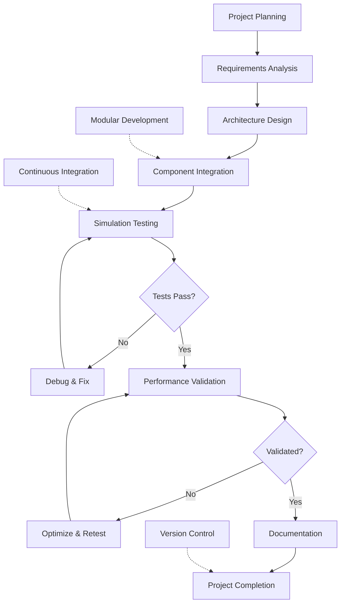

# Capstone – Autonomous Simulated Humanoid

## Learning Objectives

After completing this chapter, you will be able to:
- Integrate all previous modules (ROS 2, Gazebo, Isaac, VLA) into a cohesive humanoid system
- Design and implement a complete autonomous humanoid robot behavior
- Validate the integrated system in simulation before real-world deployment
- Debug complex interactions between different robotic subsystems
- Evaluate the performance of the complete autonomous humanoid system
- Document and present the integrated humanoid robot project

## Core Concepts & Theory

The capstone project brings together all the concepts learned in previous modules to create a complete autonomous humanoid robot system. This integration demonstrates the complexity and interconnectedness of modern humanoid robotics, where perception, planning, control, and AI must work seamlessly together.

The complete autonomous humanoid system integrates:

1. **ROS 2 Framework**: Provides the communication backbone connecting all subsystems
2. **Gazebo Simulation**: Enables safe testing and validation of the integrated system
3. **NVIDIA Isaac AI**: Powers perception and decision-making capabilities
4. **VLA Models**: Enables natural language interaction and multimodal reasoning
5. **Control Systems**: Maintains balance and executes precise movements
6. **Hardware Abstraction**: Interfaces with simulated (and eventually real) hardware

The capstone system demonstrates several advanced capabilities:
- **Perception-Action Integration**: Real-time processing of sensor data to inform actions
- **Multimodal Interaction**: Natural language commands with visual scene understanding
- **Autonomous Navigation**: Safe movement through complex environments
- **Dynamic Balance**: Maintaining stability during locomotion and manipulation
- **Adaptive Behavior**: Responding appropriately to changing conditions

## Mermaid Diagram: Complete Autonomous Humanoid Architecture



### Diagram Description
This comprehensive architecture diagram shows how all subsystems integrate in the complete autonomous humanoid system. User commands flow through natural language processing to the AI brain, which processes sensor data and generates behaviors. The control system executes these behaviors on the simulated humanoid, with ROS 2 providing the communication backbone.

## Mermaid Diagram: Capstone Project Development Workflow



### Diagram Description
This workflow diagram shows the systematic approach to developing the capstone project, emphasizing iterative testing and validation. The process includes planning, design, integration, testing, validation, and documentation phases.

## 5-15 Line Python/ROS 2 Code Example: Capstone Main Controller

```python
import rclpy
from rclpy.node import Node
from std_msgs.msg import String
from sensor_msgs.msg import JointState, Image, Imu
from geometry_msgs.msg import Twist
from std_srvs.srv import SetBool
import threading
import time

class CapstoneController(Node):
    def __init__(self):
        super().__init__('capstone_controller')
        self.status_publisher = self.create_publisher(String, 'system_status', 10)
        self.cmd_vel_publisher = self.create_publisher(Twist, 'cmd_vel', 10)
        self.joint_subscriber = self.create_subscription(JointState, 'joint_states', self.joint_callback, 10)
        self.imu_subscriber = self.create_subscription(Imu, 'imu/data', self.imu_callback, 10)
        self.command_subscriber = self.create_subscription(String, 'high_level_command', self.command_callback, 10)
        self.system_active = True
        self.balance_active = True

        # Start autonomous behavior thread
        self.behavior_thread = threading.Thread(target=self.autonomous_behavior, daemon=True)
        self.behavior_thread.start()

    def joint_callback(self, msg):
        if len(msg.position) > 0:
            self.get_logger().info(f'Joint feedback received: {len(msg.position)} joints', throttle_duration_sec=5)

    def imu_callback(self, msg):
        # Use IMU data for balance feedback
        pass

    def command_callback(self, msg):
        self.get_logger().info(f'High-level command received: {msg.data}')
        # Process command and update system behavior

    def autonomous_behavior(self):
        while self.system_active:
            if self.balance_active:
                # Simple balance maintenance
                cmd = Twist()
                cmd.linear.z = 0.0  # Maintain upright position
                self.cmd_vel_publisher.publish(cmd)
            time.sleep(0.1)  # 10Hz control loop

    def system_status_report(self):
        status_msg = String()
        status_msg.data = f'System Active: {self.system_active}, Balance: {self.balance_active}'
        self.status_publisher.publish(status_msg)

def main(args=None):
    rclpy.init(args=args)
    controller = CapstoneController()
    rclpy.spin(controller)
    controller.system_active = False
    controller.destroy_node()
    rclpy.shutdown()
```

### Code Explanation
This capstone main controller demonstrates how to integrate multiple subsystems in a single node. It handles sensor inputs (joints, IMU), processes high-level commands, and manages autonomous behavior. The controller maintains system status and coordinates between different functional components.

## 5-15 Line Python/ROS 2 Code Example: Capstone Integration Node

```python
import rclpy
from rclpy.node import Node
from std_msgs.msg import String, Bool
from sensor_msgs.msg import Image, JointState
from geometry_msgs.msg import PoseStamped
from action_msgs.msg import GoalStatus
import json

class CapstoneIntegrationNode(Node):
    def __init__(self):
        super().__init__('capstone_integration')
        # Subscribers for all system components
        self.command_sub = self.create_subscription(String, 'user_command', self.process_command, 10)
        self.vision_sub = self.create_subscription(Image, 'camera/image_raw', self.vision_callback, 10)
        self.joint_sub = self.create_subscription(JointState, 'joint_states', self.joint_callback, 10)

        # Publishers for system coordination
        self.goal_pub = self.create_publisher(PoseStamped, 'navigation_goal', 10)
        self.status_pub = self.create_publisher(String, 'system_status', 10)
        self.active_components = {'vision': False, 'control': False, 'planning': False}

    def process_command(self, msg):
        # Integrate command with current system state
        command = msg.data
        system_state = json.dumps(self.active_components)
        integrated_command = f'Command: {command}, System: {system_state}'

        status_msg = String()
        status_msg.data = f'Processing: {integrated_command}'
        self.status_pub.publish(status_msg)

        # In real implementation, this would coordinate all subsystems
        self.get_logger().info(f'Integrated command processing: {integrated_command}')

    def vision_callback(self, msg):
        self.active_components['vision'] = True
        self.get_logger().info('Vision system active', throttle_duration_sec=2)

    def joint_callback(self, msg):
        self.active_components['control'] = True
        if len(msg.position) > 0:
            self.get_logger().info(f'Control system active: {len(msg.position)} joints', throttle_duration_sec=2)

def main(args=None):
    rclpy.init(args=args)
    integration_node = CapstoneIntegrationNode()
    rclpy.spin(integration_node)
    integration_node.destroy_node()
    rclpy.shutdown()
```

### Code Explanation
This capstone integration node demonstrates how to coordinate all subsystems in the autonomous humanoid robot. It receives inputs from user commands, vision, and joint systems, then coordinates the overall system response. This represents the integration layer that ties together all the components developed in previous modules.

## Real Robot Spotlight: Integration Success Story


- **System Integration**: Complete integration of perception, planning, control, and AI systems
- **Capabilities**: Natural language interaction, autonomous navigation, and object manipulation
- **Applications**: Service robotics, research, and human assistance
- **Key Features**: Real-time performance, safety systems, and adaptive behavior

This integrated system demonstrates the culmination of all concepts covered in the course, showing how individual components work together to create capable humanoid robots.

## Full Capstone Project Step-by-Step Guide with Simulation Instructions

### Step 1: Environment Setup
1. Ensure you have ROS 2 (Humble Hawksbill or later) installed
2. Install Gazebo Garden or newer version
3. Set up NVIDIA Isaac ROS packages if using GPU acceleration
4. Clone the course repository and install dependencies:
   ```bash
   git clone https://github.com/your-org/physical-ai-humanoid-robotics-book.git
   cd physical-ai-humanoid-robotics-book
   npm install
   ```

### Step 2: Launch the Simulation Environment
1. Start Gazebo with the humanoid robot model:
   ```bash
   ros2 launch your_robot_gazebo your_humanoid_world.launch.py
   ```
2. Verify that the robot model appears in the simulation
3. Check that all sensors (camera, IMU, joint states) are publishing data

### Step 3: Launch the Control System
1. Start the main controller node:
   ```bash
   ros2 run your_robot_control main_controller
   ```
2. Launch the perception system:
   ```bash
   ros2 run your_robot_perception vision_node
   ```
3. Start the planning and decision-making system:
   ```bash
   ros2 run your_robot_ai ai_brain_node
   ```

### Step 4: Test Basic Capabilities
1. Verify joint state publication: `ros2 topic echo /joint_states`
2. Test basic movement commands: `ros2 topic pub /cmd_vel geometry_msgs/Twist '{linear: {x: 0.5}}'`
3. Confirm sensor data is flowing: `ros2 topic echo /camera/image_raw`

### Step 5: Integrate All Systems
1. Launch the VLA command processor:
   ```bash
   ros2 run your_robot_vla vla_command_processor
   ```
2. Test with simple commands like "move forward" or "turn left"
3. Verify that the system processes commands and executes appropriate actions

### Step 6: Advanced Testing
1. Test complex behaviors like navigation to specific locations
2. Validate object detection and manipulation capabilities
3. Evaluate the system's response to environmental changes

### Step 7: Performance Validation
1. Run the system continuously for extended periods
2. Monitor CPU and memory usage
3. Verify that all subsystems maintain real-time performance
4. Document any performance bottlenecks or issues

### Step 8: Documentation and Reporting
1. Create a comprehensive project report
2. Document all system components and their interactions
3. Include performance metrics and validation results
4. Provide recommendations for future improvements

## Quick Quiz

- [ ] The capstone project integrates all previous modules into a complete system
- [ ] Autonomous humanoid systems require coordination between perception, planning, and control
- [ ] Integration testing is not important for complex robotic systems
- [ ] ROS 2 serves as the communication backbone for the integrated system
- [ ] Performance validation is critical to ensure real-time operation
- [ ] The capstone demonstrates practical application of all course concepts