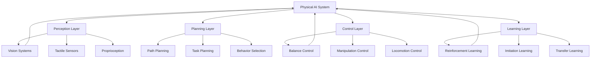
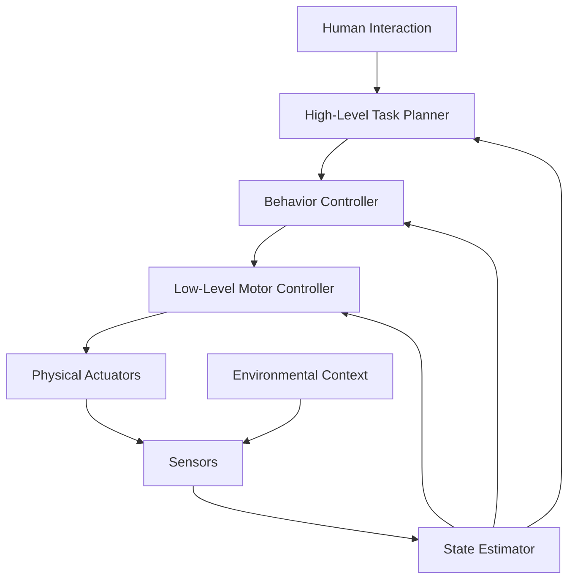

# Introduction & Why Humanoids Matter

## Learning Objectives

After completing this chapter, you will be able to:
- Understand the concept of Physical AI and embodied intelligence
- Explain why humanoid robots are important for human-robot interaction
- Identify the key challenges and opportunities in humanoid robotics
- Recognize the fundamental differences between traditional robotics and humanoid systems

## Core Concepts & Theory

Physical AI represents a paradigm shift from traditional digital AI to embodied intelligence that exists in the physical world. Unlike virtual AI systems that process information in abstract spaces, Physical AI systems must navigate, interact with, and adapt to the real world with all its complexities and uncertainties.

Humanoid robotics specifically focuses on creating robots with human-like form and capabilities. This approach offers several key advantages:

1. **Environmental Compatibility**: Humanoid robots can operate in human-designed spaces like homes, offices, and factories without requiring specialized infrastructure modifications.

2. **Social Interaction**: Human-like form factor enables more intuitive human-robot interaction, making these systems more approachable and easier to work with.

3. **Dexterous Manipulation**: Human-like hands and arms allow for manipulation of objects designed for human use.

4. **Bipedal Locomotion**: Walking on two legs enables navigation through complex terrains and obstacle courses similar to human mobility.

The field of Physical AI encompasses several key research areas:
- **Perception**: Understanding the environment through vision, touch, and other sensors
- **Control**: Coordinating complex movements and maintaining balance
- **Learning**: Adapting to new situations and improving performance over time
- **Interaction**: Communicating and collaborating with humans effectively

### The Evolution of Robotics

Traditional robotics focused on specialized, single-purpose machines operating in controlled environments. Industrial robots on assembly lines, for example, perform repetitive tasks with high precision but limited adaptability. Humanoid robotics represents a move toward general-purpose systems that can handle diverse tasks in unstructured environments.

This shift requires robots to handle uncertainty, adapt to changing conditions, and interact safely with humans. These capabilities are essential for applications in healthcare, domestic assistance, disaster response, and collaborative work environments.

## Mermaid Diagram: Physical AI Ecosystem



### Diagram Description
This diagram illustrates the interconnected layers of a Physical AI system. The perception layer gathers information about the environment, the planning layer determines appropriate actions, the control layer executes movements, and the learning layer improves performance over time. All layers continuously interact to create adaptive, responsive robotic systems.

## Mermaid Diagram: Humanoid Robot Control Architecture



### Diagram Description
This feedback control loop shows how humanoid robots maintain stability and execute tasks. High-level planning translates goals into behaviors, which are converted to motor commands. Physical actuators move the robot while sensors provide feedback about the current state. The state estimator processes sensor data to maintain awareness of the robot's position and the environment.

## 5-15 Line Python/ROS 2 Code Example: Basic Humanoid Controller

```python
import rclpy
from rclpy.node import Node
from sensor_msgs.msg import JointState
from std_msgs.msg import Float64MultiArray

class HumanoidController(Node):
    def __init__(self):
        super().__init__('humanoid_controller')
        self.joint_publisher = self.create_publisher(JointState, 'joint_states', 10)
        self.command_publisher = self.create_publisher(Float64MultiArray, 'joint_commands', 10)
        self.timer = self.create_timer(0.1, self.control_loop)
        self.get_logger().info('Humanoid Controller Started')

    def control_loop(self):
        # Basic control loop for humanoid robot
        msg = JointState()
        msg.name = ['left_hip', 'left_knee', 'right_hip', 'right_knee']
        msg.position = [0.0, 0.0, 0.0, 0.0]  # Placeholder positions
        self.joint_publisher.publish(msg)

def main(args=None):
    rclpy.init(args=args)
    controller = HumanoidController()
    rclpy.spin(controller)
    controller.destroy_node()
    rclpy.shutdown()

if __name__ == '__main__':
    main()
```

### Code Explanation
This basic ROS 2 controller demonstrates the fundamental structure of a humanoid robot controller node. It publishes joint states and commands, which are essential for robot control. The control loop runs at 10Hz (every 0.1 seconds), which is typical for basic humanoid control systems.

## 5-15 Line Python/ROS 2 Code Example: Balance Controller

```python
import rclpy
from rclpy.node import Node
from sensor_msgs.msg import Imu
from std_msgs.msg import Float64

class BalanceController(Node):
    def __init__(self):
        super().__init__('balance_controller')
        self.subscription = self.create_subscription(Imu, 'imu/data', self.imu_callback, 10)
        self.publisher = self.create_publisher(Float64, 'ankle_torque', 10)
        self.target_angle = 0.0  # Maintain upright position

    def imu_callback(self, msg):
        current_angle = msg.orientation.z  # Simplified - actual implementation would use full quaternion
        error = self.target_angle - current_angle
        control_output = 10.0 * error  # Simple proportional control

        torque_msg = Float64()
        torque_msg.data = control_output
        self.publisher.publish(torque_msg)

def main(args=None):
    rclpy.init(args=args)
    controller = BalanceController()
    rclpy.spin(controller)
    controller.destroy_node()
    rclpy.shutdown()

if __name__ == '__main__':
    main()
```

### Code Explanation
This balance controller demonstrates how humanoid robots maintain stability using IMU feedback. The controller reads orientation data from an IMU sensor and calculates corrective torques to maintain an upright position. This is a fundamental requirement for bipedal humanoid robots.

## Real Robot Spotlight: Unitree H1


- **Height**: 1.45m, **Weight**: 47kg - Compact yet powerful humanoid platform
- **Degrees of Freedom**: 23 actuators enabling human-like movement and manipulation
- **Applications**: Research, industrial assistance, and advanced robotics development
- **Key Features**: Dynamic walking, object manipulation, and autonomous navigation capabilities

Unitree H1 represents the latest advancement in commercial humanoid robotics, demonstrating the practical applications of Physical AI. Its compact design and sophisticated control systems make it ideal for research and real-world deployment.

## Real Robot Spotlight: Figure 01


- **Applications**: Office and industrial tasks, including reception, delivery, and light manufacturing
- **Key Features**: Advanced conversational AI, precise manipulation, and safe human interaction
- **Capabilities**: Multilingual communication, object recognition, and complex task execution

Figure 01 showcases the integration of advanced AI with humanoid robotics, demonstrating how these systems can work alongside humans in professional environments.

## Quick Quiz

- [ ] Physical AI bridges digital and physical intelligence
- [ ] Humanoid robots must have human-like appearance to be effective
- [ ] Embodied intelligence requires physical interaction with the environment
- [ ] Traditional robots excel in unstructured, dynamic environments
- [ ] Humanoid robots can operate in human-designed spaces without modifications
- [ ] Balance control is a fundamental challenge in humanoid robotics