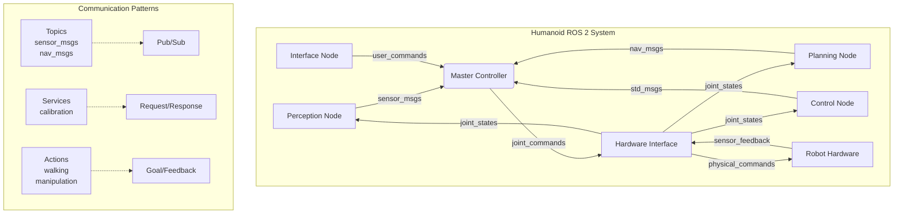
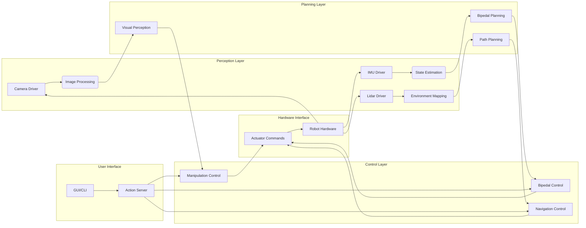

# Module 1 – ROS 2: The Robotic Nervous System

## Learning Objectives

After completing this chapter, you will be able to:
- Explain the core concepts of ROS 2 architecture and its role in humanoid robotics
- Implement nodes, topics, services, and actions for humanoid robot control
- Design communication patterns between different humanoid subsystems
- Configure ROS 2 for real-time humanoid robot applications
- Debug and monitor ROS 2 communications in complex humanoid systems

## Core Concepts & Theory

ROS 2 (Robot Operating System 2) serves as the foundational communication framework for modern humanoid robotics. Just as the nervous system enables different parts of the human body to communicate and coordinate, ROS 2 enables different software components of a humanoid robot to work together seamlessly.

The key architectural components of ROS 2 include:

1. **Nodes**: Independent processes that perform specific functions (e.g., sensor processing, control algorithms, perception)

2. **Topics**: Unidirectional communication channels for streaming data between nodes (e.g., sensor data, motor commands)

3. **Services**: Request-response communication for synchronous operations (e.g., calibration, configuration)

4. **Actions**: Goal-oriented communication for long-running tasks with feedback (e.g., walking, manipulation)

In humanoid robotics, ROS 2 enables the integration of diverse subsystems including perception, planning, control, and user interaction. The distributed nature of ROS 2 allows these systems to run on different computers or processors while maintaining real-time communication.

### ROS 2 in Humanoid Context

Humanoid robots require real-time communication between multiple subsystems:
- **Perception nodes**: Process sensor data (cameras, IMU, force/torque sensors)
- **Planning nodes**: Generate motion plans and high-level behaviors
- **Control nodes**: Execute low-level motor commands and maintain balance
- **Interface nodes**: Handle human-robot interaction and remote control

The real-time performance requirements of humanoid robotics demand careful configuration of ROS 2 Quality of Service (QoS) settings, including reliability, durability, and deadline policies.

## Mermaid Diagram: ROS 2 Architecture for Humanoid Robot



### Diagram Description
This diagram shows the ROS 2 architecture for a humanoid robot, with different nodes handling specific functions. The Master Controller acts as a coordinator, receiving sensor data, sending commands, and managing the overall system state. Communication patterns include topics for streaming data, services for configuration, and actions for complex tasks.

## Mermaid Diagram: Humanoid Robot Computation Graph



### Diagram Description
This computation graph shows the data flow in a humanoid robot system. Perception nodes process raw sensor data, planning nodes generate high-level commands, and control nodes execute precise motor actions. The system maintains a feedback loop through sensor data and provides user interfaces for remote control and monitoring.

## 5-15 Line Python/ROS 2 Code Example: Humanoid Perception Node

```python
import rclpy
from rclpy.node import Node
from sensor_msgs.msg import Image, Imu, JointState
from std_msgs.msg import String

class HumanoidPerceptionNode(Node):
    def __init__(self):
        super().__init__('humanoid_perception')
        self.image_sub = self.create_subscription(Image, 'camera/image_raw', self.image_callback, 10)
        self.imu_sub = self.create_subscription(Imu, 'imu/data', self.imu_callback, 10)
        self.joint_sub = self.create_subscription(JointState, 'joint_states', self.joint_callback, 10)
        self.status_pub = self.create_publisher(String, 'perception_status', 10)

    def image_callback(self, msg):
        self.get_logger().info(f'Received image with shape: {msg.height}x{msg.width}')

    def imu_callback(self, msg):
        orientation = msg.orientation
        self.get_logger().info(f'IMU orientation: ({orientation.x}, {orientation.y}, {orientation.z})')

    def joint_callback(self, msg):
        if len(msg.position) > 0:
            self.get_logger().info(f'First joint position: {msg.position[0]}')

def main(args=None):
    rclpy.init(args=args)
    perception_node = HumanoidPerceptionNode()
    rclpy.spin(perception_node)
    perception_node.destroy_node()
    rclpy.shutdown()
```

### Code Explanation
This perception node demonstrates how a humanoid robot processes sensor data from multiple sources. It subscribes to camera images, IMU data, and joint states, which are essential for robot awareness and control. The node processes this information and publishes status updates.

## 5-15 Line Python/ROS 2 Code Example: Bipedal Control Node

```python
import rclpy
from rclpy.node import Node
from sensor_msgs.msg import JointState, Imu
from trajectory_msgs.msg import JointTrajectory, JointTrajectoryPoint
import math

class BipedalController(Node):
    def __init__(self):
        super().__init__('bipedal_controller')
        self.joint_pub = self.create_publisher(JointTrajectory, 'joint_trajectory', 10)
        self.imu_sub = self.create_subscription(Imu, 'imu/data', self.imu_callback, 10)
        self.balance_timer = self.create_timer(0.02, self.balance_control)  # 50Hz control loop
        self.roll_pitch = [0.0, 0.0]

    def imu_callback(self, msg):
        # Extract roll and pitch from IMU quaternion
        # Simplified for example
        self.roll_pitch[0] = msg.orientation.x
        self.roll_pitch[1] = msg.orientation.y

    def balance_control(self):
        # Simple balance control based on IMU feedback
        trajectory = JointTrajectory()
        trajectory.joint_names = ['left_ankle', 'right_ankle', 'left_hip', 'right_hip']

        point = JointTrajectoryPoint()
        # Adjust ankle positions based on roll/pitch
        point.positions = [
            self.roll_pitch[1] * 0.1,  # Left ankle correction
            -self.roll_pitch[1] * 0.1, # Right ankle correction
            -self.roll_pitch[0] * 0.05, # Left hip correction
            self.roll_pitch[0] * 0.05   # Right hip correction
        ]
        point.time_from_start.sec = 0
        point.time_from_start.nanosec = 20000000  # 20ms
        trajectory.points.append(point)

        self.joint_pub.publish(trajectory)

def main(args=None):
    rclpy.init(args=args)
    controller = BipedalController()
    rclpy.spin(controller)
    controller.destroy_node()
    rclpy.shutdown()
```

### Code Explanation
This bipedal controller implements balance control using IMU feedback. It runs at 50Hz (20ms intervals) to maintain real-time control, adjusting ankle and hip positions to maintain balance based on the robot's orientation. This is critical for humanoid robots to maintain stability.

## Real Robot Spotlight: Boston Dynamics Atlas


- **Control System**: Advanced ROS-based control architecture with custom real-time extensions
- **Sensors**: Multiple cameras, LIDAR, IMU, and force/torque sensors for comprehensive environment awareness
- **Applications**: Research in dynamic locomotion, manipulation, and human-robot interaction
- **Key Features**: Dynamic balance, complex movement planning, and robust control algorithms

Atlas represents the pinnacle of ROS-based humanoid control, demonstrating how ROS 2 can be extended for high-performance real-time applications.

## Real Robot Spotlight: Tesla Bot Optimus


- **Architecture**: Integrated ROS 2 framework for sensor processing, planning, and control
- **AI Integration**: Direct connection to Tesla's AI systems for advanced perception and decision making
- **Applications**: Domestic and industrial tasks with focus on safety and reliability
- **Key Features**: Vision-based navigation, dexterous manipulation, and continuous learning capabilities

Tesla Bot showcases the integration of advanced AI with ROS 2, highlighting the importance of robust communication frameworks in next-generation humanoid systems.

## Quick Quiz

- [ ] ROS 2 nodes communicate through topics, services, and actions
- [ ] Quality of Service (QoS) settings are not important for humanoid robots
- [ ] The computation graph shows how different ROS 2 nodes are connected
- [ ] Bipedal control requires real-time sensor feedback
- [ ] ROS 2 enables distributed processing across multiple computers
- [ ] Actions are used for long-running tasks with feedback