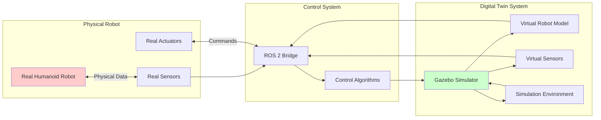

# Module 2 – Gazebo & Digital Twin Simulation

## Learning Objectives

After completing this chapter, you will be able to:
- Design and implement URDF models for humanoid robots in Gazebo
- Configure physics properties and sensors for realistic simulation
- Implement digital twin concepts for real-sim transfer
- Create complex simulation environments for humanoid testing
- Validate robot behaviors in simulation before real-world deployment
- Optimize simulation parameters for accurate humanoid dynamics

## Core Concepts & Theory

Gazebo serves as the primary simulation environment for humanoid robotics, providing a physics-accurate digital twin of real-world robots and environments. The digital twin concept involves creating a virtual replica of a physical robot that mirrors its behavior, enabling safe testing and development without risk to expensive hardware.

In humanoid robotics, simulation is critical due to:
- **Safety**: Testing dynamic behaviors like walking and manipulation without risk of falls
- **Cost**: Avoiding wear and tear on expensive humanoid hardware
- **Repeatability**: Running identical experiments multiple times for validation
- **Environment Variety**: Testing in diverse scenarios without physical setup
- **Parallel Development**: Simultaneous development of software and hardware

The Unified Robot Description Format (URDF) defines the physical structure of humanoid robots, including:
- **Links**: Rigid bodies representing robot parts (torso, limbs, etc.)
- **Joints**: Connections between links with specific degrees of freedom
- **Inertial Properties**: Mass, center of mass, and inertia tensors
- **Visual Elements**: Meshes and colors for rendering
- **Collision Elements**: Shapes for physics simulation
- **Sensors**: Camera, IMU, force/torque sensors, etc.

## Mermaid Diagram: Digital Twin Architecture



### Diagram Description
This diagram shows the digital twin architecture where a physical robot and its virtual counterpart are connected through a ROS 2 bridge. The physical robot sends sensor data to the simulation, while the simulation provides a testing environment for control algorithms before deployment to the real robot.

## Mermaid Diagram: Gazebo Simulation Pipeline

```mermaid
graph TD
    A[URDF Model] --> B[Model Parser]
    B --> C[Physics Engine<br/>(ODE/SDFormat)]
    C --> D[Collision Detection]
    D --> E[Force Computation]
    E --> F[Integration<br/>ODE Solver]
    F --> G[State Update]
    G --> H[Sensor Simulation]
    H --> I[Visualization]
    I --> J[ROS 2 Interface]
    J --> A

    K[Environment Model] --> C
    L[Controller Commands] --> E
    M[Sensor Data] --> J
```

### Diagram Description
This pipeline shows how Gazebo processes robot models and simulates physics. The URDF model is parsed into the physics engine, which computes collisions and forces. The system integrates these forces to update the robot's state, simulates sensors, and provides visualization. The ROS 2 interface allows external control and monitoring.

## 5-15 Line Python/ROS 2 Code Example: Gazebo Spawner Node

```python
import rclpy
from rclpy.node import Node
from std_srvs.srv import SetBool
from gazebo_msgs.srv import SpawnEntity
import os

class GazeboSpawner(Node):
    def __init__(self):
        super().__init__('gazebo_spawner')
        self.spawn_client = self.create_client(SpawnEntity, '/spawn_entity')
        while not self.spawn_client.wait_for_service(timeout_sec=1.0):
            self.get_logger().info('Spawn service not available, waiting again...')

    def spawn_humanoid_robot(self, name, model_path, x=0.0, y=0.0, z=1.0):
        request = SpawnEntity.Request()
        request.name = name
        request.xml = self.load_model_xml(model_path)
        request.initial_pose.position.x = x
        request.initial_pose.position.y = y
        request.initial_pose.position.z = z

        future = self.spawn_client.call_async(request)
        return future

    def load_model_xml(self, path):
        with open(path, 'r') as file:
            return file.read()

def main(args=None):
    rclpy.init(args=args)
    spawner = GazeboSpawner()
    # Example usage: spawner.spawn_humanoid_robot('my_humanoid', '/path/to/model.sdf')
    spawner.destroy_node()
    rclpy.shutdown()
```

### Code Explanation
This Gazebo spawner node demonstrates how to programmatically spawn robot models in simulation. It uses the Gazebo spawn_entity service to place robots at specific locations in the simulation environment, which is essential for automated testing scenarios.

## 5-15 Line Python/ROS 2 Code Example: Simulation State Publisher

```python
import rclpy
from rclpy.node import Node
from sensor_msgs.msg import JointState
from gazebo_msgs.msg import LinkStates
from std_msgs.msg import Header
import math

class SimulationStatePublisher(Node):
    def __init__(self):
        super().__init__('simulation_state_publisher')
        self.joint_pub = self.create_publisher(JointState, 'joint_states', 10)
        self.link_sub = self.create_subscription(
            LinkStates, '/gazebo/link_states', self.link_callback, 10)
        self.timer = self.create_timer(0.05, self.publish_joint_states)  # 20Hz
        self.joint_names = ['left_hip', 'left_knee', 'right_hip', 'right_knee', 'left_shoulder', 'right_shoulder']
        self.joint_positions = [0.0] * len(self.joint_names)

    def link_callback(self, msg):
        # Process link states from Gazebo simulation
        # This is a simplified example - actual implementation would extract joint angles from link poses
        self.get_logger().info(f'Received {len(msg.name)} links from simulation')

    def publish_joint_states(self):
        msg = JointState()
        msg.header = Header()
        msg.header.stamp = self.get_clock().now().to_msg()
        msg.name = self.joint_names
        msg.position = self.joint_positions
        msg.velocity = [0.0] * len(self.joint_names)
        msg.effort = [0.0] * len(self.joint_names)

        self.joint_pub.publish(msg)

def main(args=None):
    rclpy.init(args=args)
    publisher = SimulationStatePublisher()
    rclpy.spin(publisher)
    publisher.destroy_node()
    rclpy.shutdown()
```

### Code Explanation
This simulation state publisher demonstrates how to interface with Gazebo's simulation state and publish joint states for visualization and control. It subscribes to Gazebo's link states and publishes joint states that can be used by other ROS 2 nodes for control and visualization.

## Real Robot Spotlight: NVIDIA Isaac Sim


- **Physics Engine**: Advanced GPU-accelerated physics simulation for complex humanoid scenarios
- **AI Integration**: Direct integration with NVIDIA's AI frameworks for perception and control training
- **Applications**: Training and testing of AI models for humanoid robots in realistic environments
- **Key Features**: High-fidelity physics, realistic lighting, and large-scale environment simulation

NVIDIA Isaac Sim represents the next generation of simulation platforms, specifically designed for AI-powered robots with emphasis on realistic physics and rendering.

## Real Robot Spotlight: Open Robotics Gazebo


- **Flexibility**: Supports multiple physics engines (ODE, Bullet, Simbody) for different simulation needs
- **URDF Integration**: Native support for ROS-compatible robot models
- **Applications**: Research, development, and testing of humanoid robots across academia and industry
- **Key Features**: Realistic physics simulation, sensor simulation, and plugin architecture for custom functionality

Gazebo remains the standard simulation platform for ROS-based humanoid robotics, providing the foundation for countless research projects and commercial developments.

## Quick Quiz

- [ ] Digital twins enable safe testing of robot behaviors before real-world deployment
- [ ] URDF defines the physical structure of robots including links, joints, and sensors
- [ ] Gazebo simulation is not important for humanoid robotics development
- [ ] Physics engines compute forces and collisions in simulation
- [ ] Simulation state publishers bridge Gazebo and ROS 2 systems
- [ ] Real-sim transfer requires careful calibration to match real and simulated behaviors