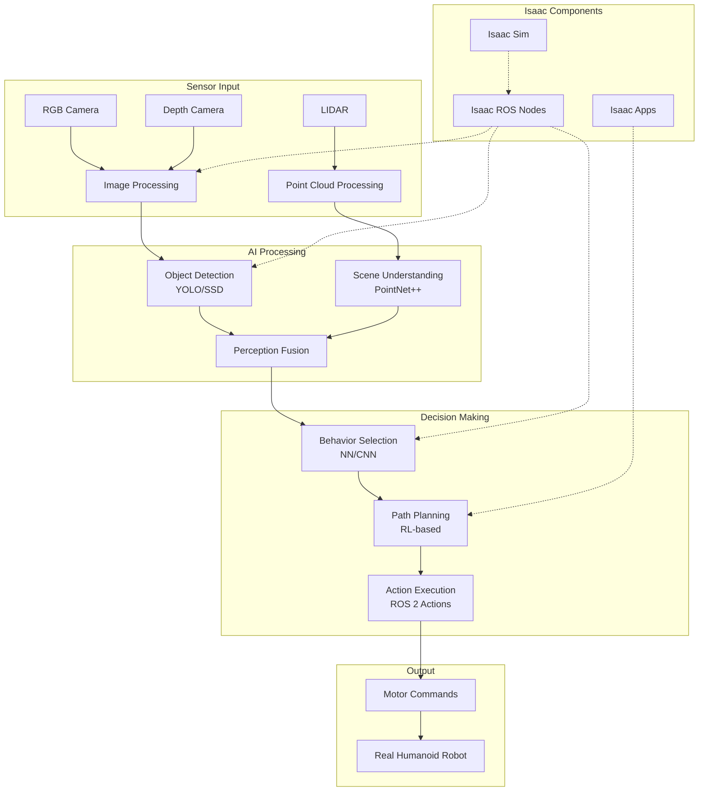
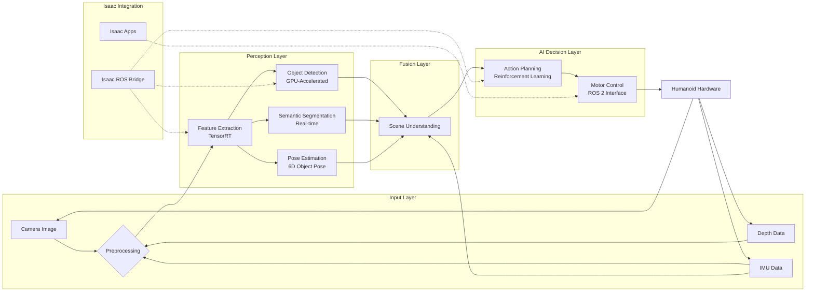

# Module 3 – NVIDIA Isaac: The AI Robot Brain

## Learning Objectives

After completing this chapter, you will be able to:
- Understand the NVIDIA Isaac ecosystem for AI-powered robotics
- Implement perception systems using Isaac's computer vision capabilities
- Integrate deep learning models for humanoid robot decision making
- Configure Isaac for real-time AI inference on humanoid platforms
- Design AI pipelines that process sensor data for humanoid behavior
- Optimize AI models for deployment on humanoid robot hardware

## Core Concepts & Theory

NVIDIA Isaac represents a comprehensive AI framework specifically designed for robotics applications, with particular strength in humanoid robotics. The framework provides the "brain" for intelligent robots, processing sensor data through AI algorithms to enable perception, decision making, and adaptive behavior.

The key components of the Isaac ecosystem include:

1. **Isaac ROS**: A collection of hardware-accelerated perception and navigation packages that integrate with ROS 2
2. **Isaac Sim**: High-fidelity simulation environment for training and testing AI models
3. **Isaac Apps**: Pre-built applications for common robotics tasks
4. **Deep Learning Models**: Pre-trained models for perception tasks like object detection, pose estimation, and navigation
5. **Isaac Lab**: Tools for developing, training, and deploying AI for robots

In humanoid robotics, Isaac addresses critical challenges:
- **Perception**: Processing visual, tactile, and other sensor data to understand the environment
- **Planning**: Using AI to make decisions about movement and interaction
- **Learning**: Enabling robots to adapt and improve through experience
- **Real-time Processing**: Optimizing AI models to run within the timing constraints of humanoid control systems

The integration of Isaac with ROS 2 enables seamless deployment of AI capabilities on humanoid platforms, allowing robots to perceive and interact with the world intelligently.

## Mermaid Diagram: Isaac AI Pipeline Architecture



### Diagram Description
This diagram shows the Isaac AI pipeline architecture for humanoid robotics. Sensor data flows through various AI processing stages, from low-level perception to high-level decision making. Isaac components integrate with the pipeline to provide specialized AI capabilities and simulation support.

## Mermaid Diagram: Isaac Perception System



### Diagram Description
This perception system diagram shows how Isaac processes multiple sensor inputs through AI algorithms to enable intelligent behavior. The system performs real-time processing using GPU acceleration, with Isaac components providing specialized robotics functionality.

## 5-15 Line Python/ROS 2 Code Example: Isaac Perception Node

```python
import rclpy
from rclpy.node import Node
from sensor_msgs.msg import Image
from std_msgs.msg import String
from cv_bridge import CvBridge
import cv2
import numpy as np

class IsaacPerceptionNode(Node):
    def __init__(self):
        super().__init__('isaac_perception')
        self.bridge = CvBridge()
        self.image_sub = self.create_subscription(Image, 'camera/image_raw', self.image_callback, 10)
        self.object_pub = self.create_publisher(String, 'detected_objects', 10)

    def image_callback(self, msg):
        # Convert ROS image to OpenCV format
        cv_image = self.bridge.imgmsg_to_cv2(msg, desired_encoding='bgr8')

        # Placeholder for Isaac AI processing
        # In real implementation, this would use Isaac's AI models
        height, width = cv_image.shape[:2]
        center_x, center_y = width // 2, height // 2

        # Simple detection: check if there's significant color variation
        if np.std(cv_image) > 30:  # Detect if scene is not uniform
            detection_msg = String()
            detection_msg.data = f'Object detected at center ({center_x}, {center_y})'
            self.object_pub.publish(detection_msg)
            self.get_logger().info(f'Published: {detection_msg.data}')

def main(args=None):
    rclpy.init(args=args)
    perception_node = IsaacPerceptionNode()
    rclpy.spin(perception_node)
    perception_node.destroy_node()
    rclpy.shutdown()
```

### Code Explanation
This Isaac perception node demonstrates how to process camera images using computer vision techniques. In a real Isaac implementation, this would integrate with Isaac's AI models for object detection, pose estimation, and scene understanding. The node processes images and publishes detected objects to other ROS 2 nodes.

## 5-15 Line Python/ROS 2 Code Example: Isaac AI Inference Node

```python
import rclpy
from rclpy.node import Node
from sensor_msgs.msg import Image, PointCloud2
from std_msgs.msg import Float32MultiArray
import numpy as np

class IsaacAINode(Node):
    def __init__(self):
        super().__init__('isaac_ai')
        self.image_sub = self.create_subscription(Image, 'camera/image_raw', self.image_callback, 10)
        self.pointcloud_sub = self.create_subscription(PointCloud2, 'depth/points', self.pc_callback, 10)
        self.behavior_pub = self.create_publisher(Float32MultiArray, 'behavior_commands', 10)
        # Placeholder for Isaac AI model (in real implementation would load TensorRT model)
        self.ai_model_loaded = False

    def image_callback(self, msg):
        # Process image through Isaac AI pipeline
        # This is a simplified example - real implementation would use Isaac's AI models
        if not self.ai_model_loaded:
            self.get_logger().info('Loading Isaac AI model...')
            # In real implementation: self.load_isaac_model()
            self.ai_model_loaded = True

        # Simulate AI inference result
        ai_result = Float32MultiArray()
        ai_result.data = [0.5, 0.3, 0.2]  # Example: forward, turn, action probabilities
        self.behavior_pub.publish(ai_result)

    def pc_callback(self, msg):
        self.get_logger().info(f'Received point cloud with {msg.height * msg.width} points')

def main(args=None):
    rclpy.init(args=args)
    ai_node = IsaacAINode()
    rclpy.spin(ai_node)
    ai_node.destroy_node()
    rclpy.shutdown()
```

### Code Explanation
This Isaac AI node demonstrates how to integrate AI inference into a humanoid robot's decision-making process. It processes both image and point cloud data, simulating how Isaac's AI models would make decisions about robot behavior. The node publishes behavior commands based on AI analysis of sensor data.

## Real Robot Spotlight: NVIDIA Isaac Nucleus


- **AI Integration**: Seamless integration of deep learning models for perception and control
- **Hardware Acceleration**: GPU-accelerated inference for real-time AI processing
- **Applications**: Advanced perception, navigation, and manipulation for humanoid robots
- **Key Features**: Isaac ROS packages, simulation tools, and optimized AI models for robotics

NVIDIA Isaac Nucleus provides the complete AI infrastructure for humanoid robots, enabling sophisticated perception and decision-making capabilities.

## Real Robot Spotlight: Jetson AGX Orin for Humanoids


- **Processing Power**: 275 TOPS AI performance for complex humanoid AI tasks
- **Energy Efficiency**: Optimized for mobile humanoid platforms with power constraints
- **Applications**: Real-time AI inference for perception, planning, and control
- **Key Features**: Hardware-accelerated neural networks, computer vision, and sensor processing

Jetson platforms represent the ideal AI computing solution for humanoid robots, providing the computational power needed for real-time AI processing in a compact form factor.

## Quick Quiz

- [ ] NVIDIA Isaac provides AI capabilities for robotics perception and decision making
- [ ] Isaac integrates with ROS 2 for seamless deployment on humanoid platforms
- [ ] Isaac only works with NVIDIA hardware and cannot be used on other platforms
- [ ] Isaac enables real-time AI inference for humanoid robot applications
- [ ] Isaac Sim is used for training and testing AI models in simulation
- [ ] Isaac includes hardware-accelerated perception packages for robotics