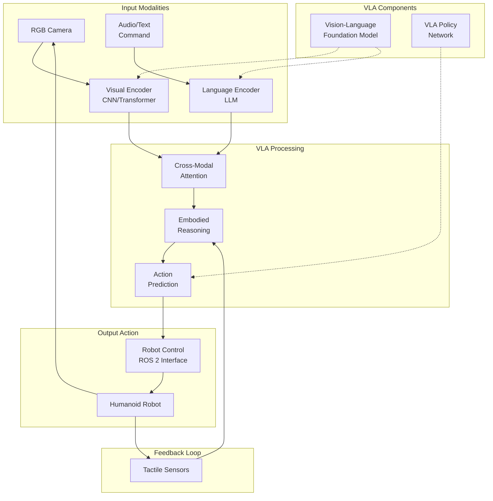
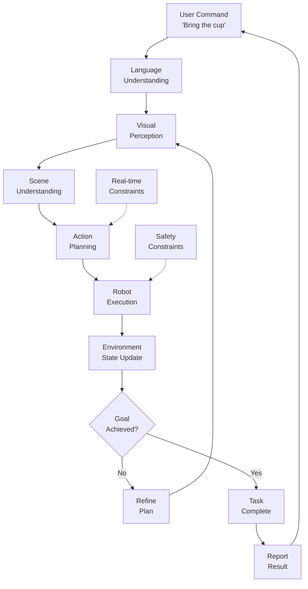

# Module 4 – Vision-Language-Action (VLA) Models

## Learning Objectives

After completing this chapter, you will be able to:
- Understand the concept and architecture of Vision-Language-Action (VLA) models
- Implement multimodal AI systems that connect vision, language, and robotic action
- Design VLA pipelines for humanoid robot task execution
- Integrate large language models with perception and control systems
- Evaluate the performance and safety of VLA systems in humanoid applications
- Configure VLA models for real-time humanoid robot operation

## Core Concepts & Theory

Vision-Language-Action (VLA) models represent the cutting edge of embodied AI, creating systems that can perceive the environment (Vision), understand natural language commands (Language), and execute physical actions (Action) in a unified framework. For humanoid robotics, VLA models enable natural human-robot interaction where users can issue complex commands in natural language that the robot understands, perceives in context, and executes through physical actions.

The key components of VLA systems include:

1. **Vision Encoder**: Processes visual input from cameras and other visual sensors to understand the environment
2. **Language Encoder**: Interprets natural language commands and queries from users
3. **Action Decoder**: Generates appropriate motor commands based on the combined vision-language understanding
4. **Fusion Mechanism**: Integrates information from vision and language modalities to make coherent decisions
5. **Embodied Reasoning**: Understands spatial relationships and physical constraints in the environment

VLA models address the fundamental challenge of grounding abstract language commands in concrete physical actions. When a user says "Please bring me the red cup from the table," the VLA system must:
- Perceive the environment to locate the red cup and table (Vision)
- Understand the command and the relationship between objects (Language)
- Plan and execute the sequence of actions to grasp and transport the cup (Action)

## Mermaid Diagram: VLA Model Architecture



### Diagram Description
This diagram shows the VLA model architecture where visual and language inputs are processed through specialized encoders, combined through cross-modal attention, and used for embodied reasoning to generate appropriate actions. The system maintains a feedback loop with the physical robot to adapt to changing conditions.

## Mermaid Diagram: VLA Reasoning Loop



### Diagram Description
This reasoning loop shows how VLA systems process commands through multiple stages: understanding the language command, perceiving the visual scene, understanding the spatial relationships, planning actions, executing with the robot, and updating based on the environment state. The loop continues until the goal is achieved.

## 5-15 Line Python/ROS 2 Code Example: VLA Command Processor

```python
import rclpy
from rclpy.node import Node
from sensor_msgs.msg import Image
from std_msgs.msg import String
from geometry_msgs.msg import Pose
from cv_bridge import CvBridge
import cv2
import numpy as np

class VLACommandProcessor(Node):
    def __init__(self):
        super().__init__('vla_command_processor')
        self.bridge = CvBridge()
        self.command_sub = self.create_subscription(String, 'user_command', self.command_callback, 10)
        self.image_sub = self.create_subscription(Image, 'camera/image_raw', self.image_callback, 10)
        self.action_pub = self.create_publisher(Pose, 'robot_action', 10)
        self.current_image = None
        self.vla_model_ready = False

    def command_callback(self, msg):
        command = msg.data
        self.get_logger().info(f'Received command: {command}')

        if self.current_image is not None and self.vla_model_ready:
            # In real implementation, this would use a VLA model
            # For now, simple keyword-based action selection
            if 'cup' in command.lower():
                action = Pose()
                action.position.x = 0.5  # Move forward to approach cup
                action.orientation.z = 1.0  # Prepare for grasp
                self.action_pub.publish(action)
                self.get_logger().info('Published cup approach action')

    def image_callback(self, msg):
        self.current_image = self.bridge.imgmsg_to_cv2(msg, desired_encoding='bgr8')
        if not self.vla_model_ready:
            self.get_logger().info('VLA model initialized with visual input')
            self.vla_model_ready = True

def main(args=None):
    rclpy.init(args=args)
    vla_node = VLACommandProcessor()
    rclpy.spin(vla_node)
    vla_node.destroy_node()
    rclpy.shutdown()
```

### Code Explanation
This VLA command processor demonstrates the basic structure of a system that processes natural language commands in the context of visual perception. The node receives user commands and camera images, then generates appropriate robot actions based on the combination of language understanding and visual perception. In a real implementation, this would use sophisticated VLA models.

## 5-15 Line Python/ROS 2 Code Example: VLA Action Planner

```python
import rclpy
from rclpy.node import Node
from std_msgs.msg import String
from action_msgs.msg import GoalStatus
from geometry_msgs.msg import PoseStamped
import json

class VLAActionPlanner(Node):
    def __init__(self):
        super().__init__('vla_action_planner')
        self.command_sub = self.create_subscription(String, 'parsed_command', self.plan_callback, 10)
        self.plan_pub = self.create_publisher(PoseStamped, 'navigation_goal', 10)
        self.known_objects = {
            'cup': {'x': 1.0, 'y': 0.5, 'height': 0.1},
            'table': {'x': 1.2, 'y': 0.3, 'height': 0.75},
            'chair': {'x': 0.8, 'y': 1.0, 'height': 0.5}
        }

    def plan_callback(self, msg):
        command_data = json.loads(msg.data) if msg.data.startswith('{') else {'command': msg.data}
        action_type = command_data.get('action', '')
        target_object = command_data.get('object', '')

        if target_object in self.known_objects and 'bring' in action_type:
            # Plan navigation to object location
            goal = PoseStamped()
            obj_pos = self.known_objects[target_object]
            goal.pose.position.x = obj_pos['x']
            goal.pose.position.y = obj_pos['y']
            goal.pose.position.z = obj_pos['height'] / 2  # Approach height

            self.plan_pub.publish(goal)
            self.get_logger().info(f'Planned navigation to {target_object} at ({obj_pos["x"]}, {obj_pos["y"]})')

def main(args=None):
    rclpy.init(args=args)
    planner = VLAActionPlanner()
    rclpy.spin(planner)
    planner.destroy_node()
    rclpy.shutdown()
```

### Code Explanation
This VLA action planner demonstrates how to plan robot actions based on VLA system outputs. It receives parsed commands and uses knowledge of object locations to plan navigation goals. The planner represents the action generation component of the VLA system, translating high-level commands into specific robot behaviors.

## Real Robot Spotlight: RT-2 (Robotics Transformer 2)


- **VLA Integration**: Direct integration of vision, language, and action in a single neural network
- **Generalization**: Ability to follow novel language commands and generalize to new objects
- **Applications**: Complex manipulation tasks guided by natural language instructions
- **Key Features**: Embodied reasoning, spatial understanding, and real-world grounding

RT-2 represents the state-of-the-art in VLA models, demonstrating how large-scale training can enable robots to understand and execute complex language commands.

## Real Robot Spotlight: Intrinsic AI's VLA Systems


- **Multimodal Integration**: Seamless combination of vision, language, and robotic control
- **Learning from Interaction**: Systems that improve through physical interaction with the environment
- **Applications**: Industrial and service robotics with natural human interaction
- **Key Features**: Real-time processing, safety constraints, and adaptive behavior

Intrinsic AI's systems demonstrate the practical applications of VLA models in real-world robotics scenarios, showing the potential for natural human-robot collaboration.

## Quick Quiz

- [ ] VLA models connect vision, language, and action in a unified framework
- [ ] VLA systems enable natural language interaction with humanoid robots
- [ ] VLA models require separate systems for each modality (vision, language, action)
- [ ] VLA systems can ground abstract language commands in concrete physical actions
- [ ] Cross-modal attention is important for combining vision and language inputs
- [ ] VLA models enable embodied reasoning for spatial and physical understanding