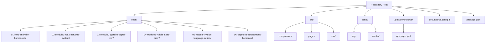

# Implementation Plan: [FEATURE]

**Branch**: `[###-feature-name]` | **Date**: [DATE] | **Spec**: [link]
**Input**: Feature specification from `/specs/[###-feature-name]/spec.md`

**Note**: This template is filled in by the `/sp.plan` command. See `.specify/templates/commands/plan.md` for the execution workflow.

## Summary

This plan outlines the implementation of a 6-chapter Docusaurus-based course book on "Physical AI & Humanoid Robotics". The site will be deployed on GitHub Pages and will follow the module-wise structure: Introduction, ROS 2 (Nervous System), Gazebo (Digital Twin), NVIDIA Isaac (AI-Robot Brain), Vision-Language-Action, and Capstone Project. Each chapter will include learning objectives, core concepts, 2-4 Mermaid diagrams, 5–15 line runnable Python/ROS 2 code snippets (copy-paste ready), real robot spotlights, and Markdown checkbox quizzes. The implementation will follow 5 phases: Docusaurus initialization, content creation for first 3 chapters, content creation for last 3 chapters, media integration, and deployment with performance validation.

## Technical Context

**Language/Version**: JavaScript/TypeScript, Node.js v18+ for Docusaurus v3, Python 3.8+ for ROS 2 examples
**Primary Dependencies**: Docusaurus v3 with classic preset, React v18, Node.js, npm, MDX v2/v3
**Storage**: Static file storage in Git repository, images in /static/img, documentation in /docs
**Testing**: Manual testing of documentation rendering, code snippet validation, Lighthouse performance testing
**Target Platform**: Web-based documentation site deployed on GitHub Pages, accessible via browsers
**Project Type**: Static website/documentation generator using Docusaurus framework
**Performance Goals**: Page load time < 4 seconds, Lighthouse score ≥ 90 for performance/accessibility, mobile-friendly rendering
**Constraints**: Repository size < 500 MB, use only free tiers of services, all content must be open source (MIT/CC-BY-SA)
**Scale/Scope**: 6 core chapters with interactive elements, targeting 1000+ concurrent readers during course delivery

## Constitution Check

*GATE: Must pass before Phase 0 research. Re-check after Phase 1 design.*

### Pre-Design Compliance Verification

**Technical Accuracy First**: All content must be technically accurate and factually correct with verifiable sources and citations.
- ✅ Plan includes verification of code examples and technical content
- ✅ Plan incorporates IEEE-style citations as required

**Learn-by-doing Pedagogy**: Every chapter must contain at least one runnable code example (Python/ROS2), one Mermaid diagram, and one short quiz/exercise.
- ✅ Plan includes 5–15 line runnable Python/ROS 2 code snippets (copy-paste ready) in each chapter
- ✅ Plan includes 2-4 Mermaid diagrams per chapter
- ✅ Plan includes Markdown checkbox quizzes in each chapter

**Beginner-to-Advanced Progression**: Content must start from zero robotics background and end with the ability to design a simple humanoid subsystem.
- ✅ Plan follows module structure from intro to advanced topics (ROS2 → Gazebo → NVIDIA Isaac → VLA)

**Open Source & Reproducible**: All code, datasets, CAD files, and simulation environments must be free and linkable.
- ✅ Plan uses MIT license for code and CC-BY-SA-4.0 for text
- ✅ Plan uses open-source tools (Docusaurus, ROS 2, etc.)

**Real-World Grounding**: Every major section must reference at least one real humanoid robot.
- ✅ Plan includes "Real Robot Spotlight" section with photos/videos and specs in each chapter

**Future-Proof Content**: Prefer up-to-date (2024–2025) sources, frameworks, and hardware trends.
- ✅ Plan uses current Docusaurus v3 and latest ROS 2 versions
- ✅ Plan references current humanoid robots and technologies

### Post-Design Compliance Verification

All constitutional requirements remain satisfied after Phase 1 design:

**Data Model Alignment**: The data model supports all constitutional requirements with entities for modules, diagrams, code examples, and real robot spotlights.

**Technical Context**: The technology stack (Docusaurus v3, MDX, React) enables the required interactive elements and accessibility features.

**Repository Structure**: The planned structure supports the constitutional requirements for content organization and open-source licensing.

**Implementation Phases**: The 5-phase approach ensures gradual implementation while maintaining quality standards.

All constitutional requirements continue to be satisfied by this plan.

## Project Structure

### Documentation (this feature)

```text
specs/[###-feature]/
├── plan.md              # This file (/sp.plan command output)
├── research.md          # Phase 0 output (/sp.plan command)
├── data-model.md        # Phase 1 output (/sp.plan command)
├── quickstart.md        # Phase 1 output (/sp.plan command)
├── contracts/           # Phase 1 output (/sp.plan command)
└── tasks.md             # Phase 2 output (/sp.tasks command - NOT created by /sp.plan)
```

### Repository Structure (Mermaid diagram)



### Source Code (repository root)

```text
/
├── docs/                           # Documentation files
│   ├── 01-intro-and-why-humanoids/
│   │   └── index.mdx
│   ├── 02-module1-ros2-nervous-system/
│   │   └── index.mdx
│   ├── 03-module2-gazebo-digital-twin/
│   │   └── index.mdx
│   ├── 04-module3-nvidia-isaac-brain/
│   │   └── index.mdx
│   ├── 05-module4-vision-language-action/
│   │   └── index.mdx
│   └── 06-capstone-autonomous-humanoid/
│       └── index.mdx
├── src/                           # Custom Docusaurus components
│   ├── components/
│   │   ├── Quiz/
│   │   └── Diagram/
│   ├── pages/
│   └── css/
├── static/                        # Static assets
│   ├── img/                       # Images and diagrams
│   └── media/                     # Videos and other media
├── .github/workflows/            # GitHub Actions workflows
│   └── gh-pages.yml
├── docusaurus.config.js          # Docusaurus configuration
├── sidebars.js                   # Navigation sidebar configuration
├── package.json                  # Project dependencies
├── babel.config.js               # Babel configuration
└── README.md                     # Project documentation
```

**Structure Decision**: Web application structure selected for Docusaurus-based documentation site. The site will be built as a static React application with documentation content in MDX format, deployed via GitHub Pages. The structure follows Docusaurus conventions with docs/ for content, src/ for custom components, and static/ for assets.

## Complexity Tracking

> **Fill ONLY if Constitution Check has violations that must be justified**

| Violation | Why Needed | Simpler Alternative Rejected Because |
|-----------|------------|-------------------------------------|
| [e.g., 4th project] | [current need] | [why 3 projects insufficient] |
| [e.g., Repository pattern] | [specific problem] | [why direct DB access insufficient] |
