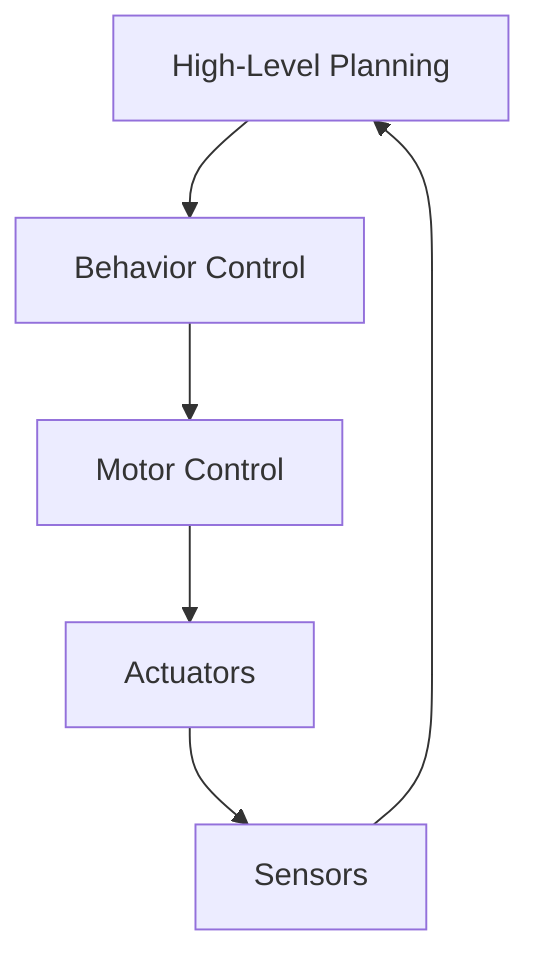

# Quickstart Guide: Physical AI & Humanoid Robotics Course Book

## Prerequisites

- Node.js v18 or higher
- npm or yarn package manager
- Git
- Basic knowledge of Markdown and React/JSX (for MDX)

## Setup Instructions

### 1. Clone and Initialize
```bash
# Clone the repository
git clone <repository-url>
cd <repository-name>

# Install dependencies
npm install
```

### 2. Start Development Server
```bash
# Start the development server
npm start

# This command starts a local development server at http://localhost:3000
```

### 3. Create a New Chapter
```bash
# Create the chapter directory with proper numbering
mkdir docs/01-intro-and-why-humanoids

# Create the MDX file
touch docs/01-intro-and-why-humanoids/index.mdx
```

### 4. Add Chapter Content
Edit `docs/01-intro-and-why-humanoids/index.mdx` with the following template:

```mdx
---
title: Introduction and Why Humanoids
sidebar_label: Introduction
sidebar_position: 1
description: Introduction to Physical AI and Humanoid Robotics
keywords: [physical ai, humanoid robotics, introduction]
---

# Introduction and Why Humanoids

## Learning Objectives
- Understand the concept of Physical AI
- Learn about the importance of humanoid robotics
- Identify key applications and real-world examples

## Core Concepts & Theory

[Your main content here]

### Mermaid Diagram: Robot Control Architecture


## 5-15 Line Python/ROS 2 Code Example
```python
import rclpy
from rclpy.node import Node

class HumanoidController(Node):
    def __init__(self):
        super().__init__('humanoid_controller')
        self.get_logger().info('Humanoid Controller Started')

def main(args=None):
    rclpy.init(args=args)
    controller = HumanoidController()
    rclpy.spin(controller)
    controller.destroy_node()
    rclpy.shutdown()

if __name__ == '__main__':
    main()
```

## Real Robot Spotlight: Atlas by Boston Dynamics


- Humanoid robot capable of dynamic movement and manipulation
- Uses advanced control algorithms for balance and locomotion
- Applications in research and specialized environments

## Quick Quiz

- [ ] Physical AI bridges digital and physical intelligence
- [ ] Humanoid robots must have human-like appearance
- [ ] Embodied intelligence requires physical interaction with the environment
```

### 5. Build the Site
```bash
# Build the static site for production
npm run build

# This creates a build/ directory with the static files
```

### 6. Deploy to GitHub Pages
The site is automatically deployed via GitHub Actions when changes are pushed to the main branch. Make sure your `.github/workflows/gh-pages.yml` exists.

## Chapter Creation Workflow

1. **Create Directory**: Use sequential numbering (01, 02, 03, etc.)
2. **Add Frontmatter**: Include title, sidebar_label, sidebar_position, description, and keywords
3. **Add Learning Objectives**: 3-5 clear objectives for the chapter
4. **Add Core Content**: Theory and concepts with proper headings
5. **Add Mermaid Diagrams**: 2-4 diagrams to visualize concepts
6. **Add Code Examples**: 5-15 line Python/ROS2 snippets
7. **Add Real Robot Spotlight**: Photo and 3 specifications
8. **Add Quiz**: Markdown checkboxes for self-assessment
9. **Validate**: Run `npm run build` to check for errors

## Frontmatter Requirements

Each chapter must include these fields in the frontmatter:

```yaml
---
title: <Chapter Title>
sidebar_label: <Sidebar Label>
sidebar_position: <Number>
description: <Brief description>
keywords: [keyword1, keyword2, keyword3]
---
```

## Adding Images

1. Place images in the `static/img/` directory
2. Reference them in MDX files with `/img/filename.jpg` path
3. Always include meaningful alt text for accessibility

## Running Tests

```bash
# Build the site to validate there are no errors
npm run build

# Run Lighthouse audit to check performance
npx lighthouse http://localhost:3000 --view
```

## Common Issues and Solutions

- **Build errors**: Check for valid MDX syntax and proper frontmatter
- **Missing images**: Ensure images are in the static/ directory
- **Broken links**: Use relative paths within the docs/ directory
- **Performance issues**: Optimize images and minimize heavy components